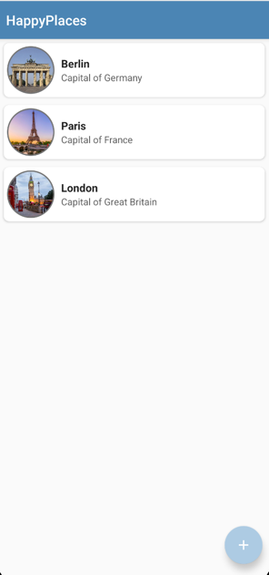
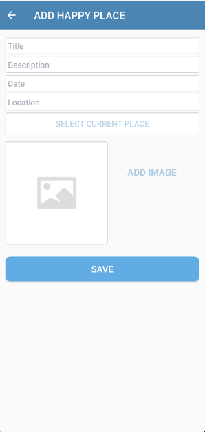
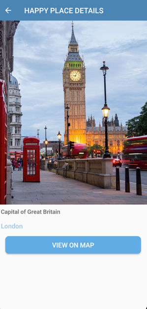
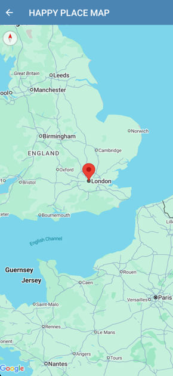

# HappyPlaces

### Android application that allows you to store your favorite places with a description, photo and location

## Used technologies and tools

- Kotlin 
- Android SDK
- Android XML
- Room database
- RecyclerView
- View binding
- [CircleImageView](https://github.com/hdodenhof/CircleImageView)
- Google Places API

## Illustrations

### Home screen

### Adding new Happy Place

### Happy Place details

### Viewing Happy Place on map

